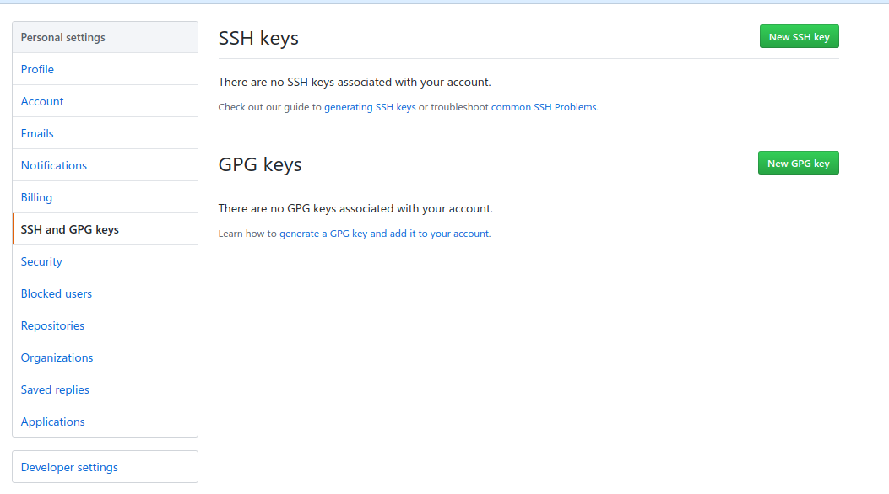
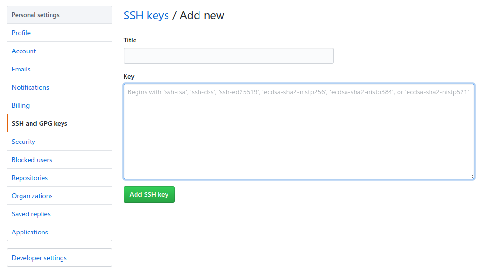

# GitHub-Skills


[TOC]

## 0.如何找到Github上最hot的开源项目

探索有趣的项目：https://github.com/explore

本日（周，月，年）热门：https://github.com/trending


## 1.Git 常用命令总结

 https://images2015.cnblogs.com/blog/710078/201609/710078-20160906110359098-1695380967.png

 


## 2.如何配置Linux Shell提交代码时默认用户和密码？

先上代码

> `git clone  xxxx`
>
> `ssh-keygen -t rsa -f ~/.ssh/github -C jianghui_galaxy@163.com`
>
> `ssh-add   ~/.ssh/github`
>
> `cat  ~/.ssh/github.pub`
>
> `git remote -v`
>
> `git  remote  set-url  origin  git@github.com:jianghui-galaxy/GitHub-Skills.git`
>
> `ssh -T git@github.com`
>
> `git config --global user.name "jianghui_galaxy@163.com"`
>
> `git config --global user.email "jianghui_galaxy@163.com"`  
>
> `git add .`
>
> `git commit -m "Github Skills"`
>
> `git push origin master`


具体步骤

(1) 检查本地用户home目录下是否以Github的用户（注意：可能以PC主机用户生成过，但是不能用作Git）生成过ssh的key，如果有则直接下一步，如果没有则执行下面的命令，为了防止覆盖以前的`id_rsa、id_rsa.pub`，这里以 `-f` 选项指定在`~/.ssh` 目录下生成`github、github.pub`文件(私钥和公钥)：

`ssh-keygen -t rsa -f ~/.ssh/github -C jianghui_galaxy@163.com` （输入三次回车）

将用户的使用的私钥添加到由`ssh-agent` 维护的列表中，（`ssh-agent` 是用于管理[SSH](https://kb.iu.edu/d/aelc) private keys的, 长时间持续运行的守护进程（daemon）. 唯一目的就是对解密的私钥进行高速缓存）

`ssh-add   ~/.ssh/github`


(2) 把公钥 `github.pub` 文件的内容添加到 Github:  `点击头像 ---> Settings ---> SSH and GPG keys ---> New SSH key`, 写好Title，然后把上面生成的`github.pub`内容复制到Key下面的输入框中

`cat ~/.ssh/github.pub`

 

 


(3) 查看本地和远程主机的连接是https还是ssh：

`git remote -v`

如果是ssh，该命令结果：

`origin	git@github.com:jianghui-galaxy/GitHub-Skills.git (fetch)`

`origin	git@github.com:jianghui-galaxy/GitHub-Skills.git (push)`

如果是https，该命令结果：

`origin	https://github.com/jianghui-galaxy/GitHub-Skills.git (fetch)`

`origin	https://github.com/jianghui-galaxy/GitHub-Skills.git (push)`


如果本地和远程主机的连接是https的，那么需要通过如下命令修改为ssh，注意这里的项目替换成自己的

`git  remote  set-url  origin  git@github.com:jianghui-galaxy/GitHub-Skills.git` 


(4) 测试ssh连接是否正常

 `ssh -T git@github.com`

如果ssh连接正常输出：

`Hi jianghui-galaxy! You've successfully authenticated, but GitHub does not provide shell access.`

如果ssh不能连接输出：

`Permission denied (publickey).`


(5) 设置提交时使用的用户和邮箱

通常设置全局提交时使用的用户和邮箱（对应配置文件~/.gitconfig）

`git config --global user.name "jianghui_galaxy@163.com"				  ##提交用户`

`git config --global user.email "jianghui_galaxy@163.com"    ##提交用户邮箱`

如果只是设置某个特定的项目提交时使用的用户和邮箱，先 cd 到项目然后（对应配置文件.git/config）

`git config --local user.email "jianghui_galaxy@163.com"`

`git config --local user.name "jianghui_galaxy@163.com"`

当然还有  `git config --system ...` （对应配置文件/etc/gitconfig）


(6) 提交试试是否需要用户名和密码

`git add .`

`git commit -m "Github Skills"`

`git push origin master`


## 3.Git资料及下载地址

(1) Pro Git

 

PDF： https://github.com/progit/progit2-zh/releases/download/2.1.8/progit_v2.1.8.pdf

在线：https://git-scm.com/book/zh/v2

​	

(2) 廖雪峰的Git教程：https://www.liaoxuefeng.com/wiki/0013739516305929606dd18361248578c67b8067c8c017b000


## 4.初次运行Git配置


查看配置 `git config --list`

```shell
git config --global user.name "jianghui_galaxy@163.com"				  ##提交用户
git config --global user.email "jianghui_galaxy@163.com"    ##提交用户邮箱

git config --global core.editor vim            ##默认使用的文本编辑器
git config --global merge.tool vimdiff         ##解决合并冲突时使用哪种差异分析工具


##git config --system
##git config --local
```

以上配置也可以手动修改：`vim ~/.gitconfig`


## 5.Github 中 MarkDown语法

 


